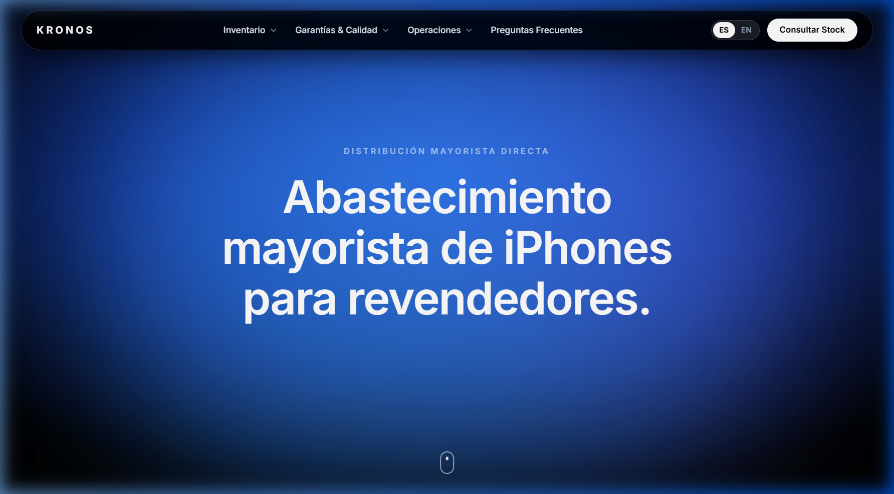
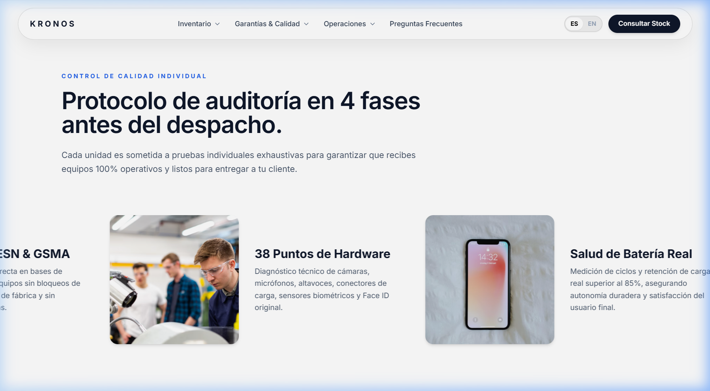
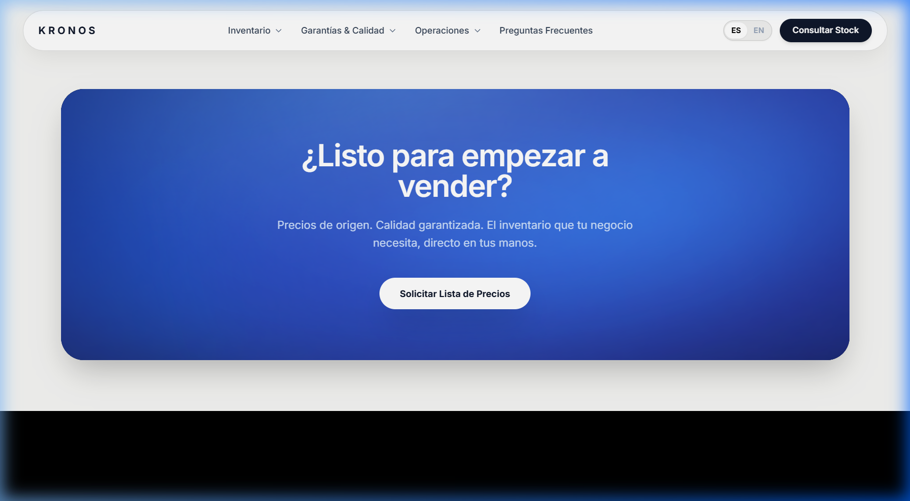

# ⚡ KRONOS — Distribución Mayorista de iPhones & B2B Tech

> **Landing Page B2B de Alta Conversión y Estética Editorial de Lujo (Apple Keynote Style)**



---

## 🌟 Características Principales

- **🎨 Dirección de Arte & Estética Premium**:
  - Atmósfera lumínica en azul cobalto profundo (`#1D4ED8`) con luz difusa respirable.
  - Tipografía limpia *Inter* con contraste jerárquico y diseño sin ruido visual.
  - Paleta equilibrada: fondos oscuros profundos y secciones claras contrastadas.

- **⚡ Física e Interacción GSAP 60fps**:
  - **Scroll Horizontal Fijado (`pin: true`)**: Al ingresar al protocolo de calidad, la pantalla bloquea el scroll vertical y traduce la rueda en un desplazamiento horizontal fluido de las 4 fases.
  - **Navbar Adaptativa Inteligente**: Detección geométrica en tiempo real (`getBoundingClientRect`) que conmuta dinámicamente entre píldora oscura con texto blanco y píldora clara con texto oscuro según el fondo.
  - **Scroll Suave Inercial**: Integración con [Lenis](https://github.com/darkroomengineering/lenis) para un desplazamiento sedoso y natural.
  - **Cámara de Oleaje Azul Líquido**: Efecto spotlight interactivo que sigue al cursor en la sección de cierre y botón con onda expansiva radial.

- **🌐 Motor Bilingüe Nativo (`ES / EN`)**:
  - Cambio instantáneo en cliente sin recargar la página (`data-i18n`).
  - Persistencia de preferencia en `localStorage`.
  - Mensajes pre-redactados dinámicos en los botones directos a WhatsApp comercial.

- **📱 100% Responsivo & Mobile First**:
  - Menú lateral táctil (*drawer*) con micro-animaciones fluidas y cierre automático al pulsar fuera.
  - Botón CTA de acción rápida en el hero adaptado para móvil.

---

## 📸 Vistas del Proyecto

| Protocolo de Calidad (Horizontal Track) | Cámara de Cierre & CTA WhatsApp |
| :---: | :---: |
|  |  |

---

## 🛠️ Stack Tecnológico

- **Core**: HTML5 Semántico + JavaScript ES6+ Nativo
- **Estilos**: [Tailwind CSS CDN](https://tailwindcss.com/)
- **Animaciones**: [GSAP (GreenSock)](https://gsap.com/) + [ScrollTrigger Plugin](https://gsap.com/scrolltrigger/)
- **Scroll Engine**: [Lenis Smooth Scroll](https://lenis.darkroom.engineering/)
- **Tipografía**: [Google Fonts (Inter)](https://fonts.google.com/specimen/Inter)

---

## 🚀 Instalación y Ejecución Local

1. **Clonar el repositorio:**
   ```bash
   git clone https://github.com/tu-usuario/kronos.git
   cd kronos
   ```

2. **Abrir localmente:**
   - Puedes abrir directamente el archivo `index.html` en cualquier navegador, o
   - Ejecutar un servidor local:
     ```bash
     npx serve .
     # o bien
     npx http-server . -p 3000
     ```

---

## 📄 Licencia

Este proyecto se encuentra bajo la Licencia MIT.
